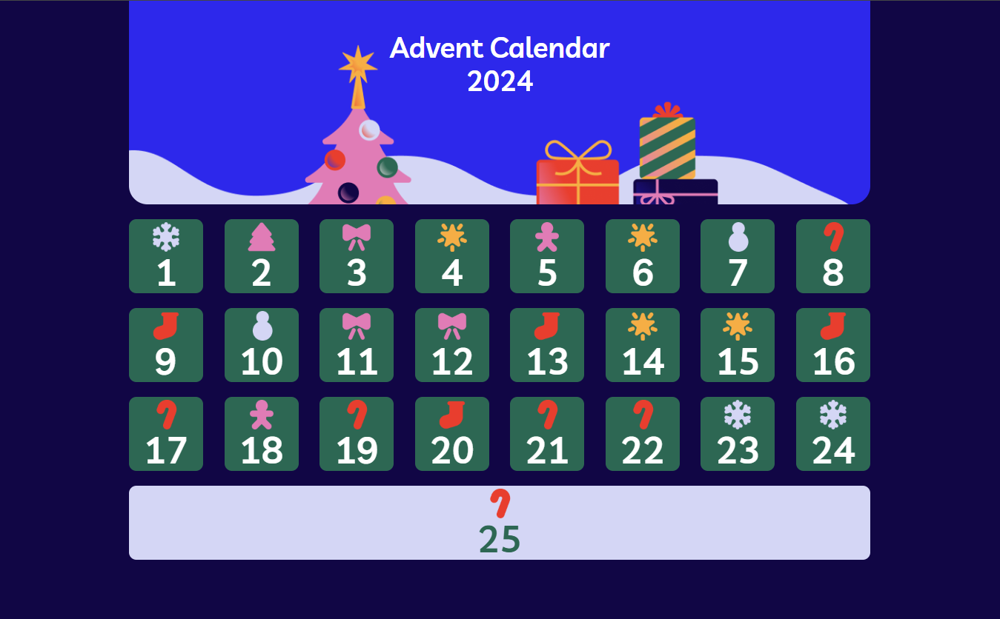

### Consegna
Creiamo il nostro **calendario dell’avvento** utilizzando HTML, CSS  e JS!

- Iniziamo col renderizzare in pagina le caselle del calendario, come mostrato nello screenshot, avendo cura di generare dinamicamente le caselle 📅
- 🧑🏻‍💻 Al click su ogni casella, dovremo far comparire una piccola modale a centro pagina e coprire lo sfondo con un overlay
- All’interno della modale mostreremo casualmente una frase o un’immagine tra quelle fornite nell’array di dati in allegato (anche le immagini sono in allegato) 🖼️
- 🪟 Una volta cliccata, una casella deve cambiare stile, apparendo appunto già “aperta”.
- Quando l’utente ricarica la pagina, questa deve ricordare quali caselle sono state già aperte 🎁

### Note 🗒️

- il font utilizzato è ***Livvic***.

### Bonus 💫

- Il calendario deve essere **responsive**
- Aggiungiamo anche un bottone per “**resettare**” la memoria della pagina e ricominciare da capo.

#### __________________________________________________
- #### Milestone 1: Creazione della struttura del calendario.
    - Renderizzazione dinamica delle caselle:
Utilizzo di JavaScript per generare dinamicamente le caselle del calendario, come mostrato nello screenshot.
Ogni casella deve essere visibile, e deve contenere un numero che rappresenta il giorno del mese.

- #### Milestone 2: Gestione del click su una casella
    - Apertura delle caselle al click:
Al click su una casella, viene visualizzata un modale al centro pagina con un'overlay che copre lo sfondo.
Il modale deve mostrare una sorpresa casuale (frase o immagine) presa da un array di dati fornito (frasi e immagini).

- #### Milestone 3: Cambiamento dello stile della casella
   - Modifica dello stile della casella:
Dopo aver cliccato una casella, essa deve apparire "aperta" (esempio: cambiamento del colore o aggiunta di un'animazione) per indicare che è già stata visualizzata.

- #### Milestone 4: Memorizzazione dello stato delle caselle
    - Memoria dello stato delle caselle:
Quando la pagina viene ricaricata, l'app deve ricordare quali caselle sono state già aperte. Questo deve essere gestito tramite il localStorage per salvare le caselle "aperte" anche dopo il refresh.

- #### Milestone 5: Funzione di reset
    - Aggiunta del pulsante "Reset":
Aggiungere un bottone per resettare la memoria della pagina e ricominciare da capo, riportando tutte le caselle nello stato iniziale (non aperte).
Il reset deve svuotare il localStorage e ripristinare lo stato del calendario.

